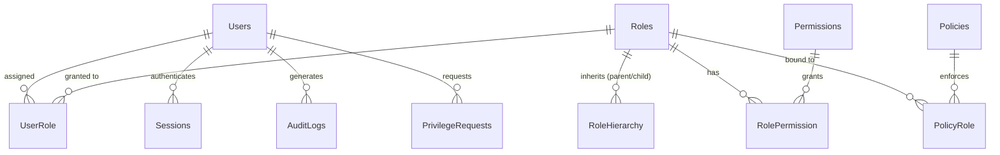

# Secure Access Control System & RBAC Analytics

A production-grade **Role-Based Access Control (RBAC)** database system built on top of a real 100,000-row Cloud Access Control dataset containing 50 security factors. The system features a fully normalized PostgreSQL database optimized for complex security analytics queries, and is accompanied by a premium, interactive frontend dashboard demonstrating live access simulation.

---

## 🎨 Frontend Architecture (`/app`)

The user interface is built entirely with Vanilla HTML, CSS, and JavaScript, creating a modern, dependency-free Single Page Application (SPA).

### Design System
- **Theme:** Deep space dark mode (`#0B0E14`) accented with Neon Teal and Purple.
- **Aesthetics:** Implements modern **Glassmorphism** (translucent frosted glass panels with `backdrop-filter: blur()`).
- **Interactivity:** Fluid tab navigation, tree-view toggles for hierarchy exploration, and hover micro-animations.

### Key Views
1. **Dashboard Overview:** Displays high-level system security metrics and active session states.
2. **Role Hierarchy:** Visualizes complex nested roles (`SuperAdmin → Admin → Developer`) via an expandable tree interface.
3. **Users & Sessions:** Detailed identity tracking including MFA, SSO, and Password authentication mechanisms.
4. **Compliance & Audits:** Highlights database conflicts (e.g., Segregation of Duties violations) and GDPR/HIPAA/SOX compliance scores.

### 🔐 Access Simulator
The standout feature of the frontend is the interactive **Access Simulator**. 
- It maps mock identities (e.g., `SuperAdmin`, `Developer`, `Guest`) to specific sets of permissions.
- As you switch identities, a mock "System Configuration" form dynamically locks and unlocks. 
- Fields requiring ungranted permissions are strictly disabled, styled with red error tints, and marked with a padlock icon to visually demonstrate how the backend RBAC constraints enforce UI restrictions.

---

## 🗄️ Backend Architecture (PostgreSQL)

The database models authentication mechanisms, authorization models, permission hierarchies, policies, sessions, and audit trails — completely normalized and hardened against data corruption.

### Schema Topology



### Advanced Database Mechanics

- **Strict Typing:** Broad use of `ENUM` types (e.g., `auth_mechanism`, `compliance_type`, `cloud_provider`) to prevent bad data.
- **JSONB Audit Logging:** An automated trigger (`fn_audit_log`) dynamically captures row changes across the entire system using PostgreSQL's native `jsonb` type, eliminating the need for external extensions like `hstore`.
- **Security Triggers:** 
  - `fn_auto_lockout`: Immediately locks user accounts after 5 failed login attempts.
  - `fn_expire_session`: Automatically sets `ended_at` timestamps to safely terminate expired sessions.
  - `fn_check_escalation_approval`: Blocks the assignment of privileged roles unless a pre-approved request exists or the assigner is a SuperAdmin. Features an `app.is_seeding` bypass for initialization.
- **Stored Procedures:** Handlers like `DetectPrivilegeEscalation()` traverse the `EffectivePermissionsView` to catch shadow-admin accounts.

---

## 📊 Dataset & Edge Cases

Derived from a 100,000-record dataset with features evaluating Authentication (MFA, SSO), Authorization (RBAC, ABAC), Compliance (GDPR, HIPAA), and Zero Trust postures.

| Edge Case Handled      | Examples in Seed Data                                  |
|------------------------|--------------------------------------------------------|
| Orphan users           | `orphan.user1`, `orphan.user2` (No roles assigned)     |
| Orphan roles           | `OrphanRole1`, `OrphanRole2` (No users assigned)       |
| Redundant roles        | `AdminV2` (Mirrors `Admin` permissions exactly)        |
| Conflicting permissions| `ReadWriteConflict` (Has both readonly + admin)        |
| Multi-role users       | `multirole.user` (Developer + Analyst + Guest)         |
| Privilege escalation   | `adam.privileged` (Admin + TempAdmin)                  |

---

## 🔍 Analytical Queries

The `queries.sql` file contains 21 advanced PostgreSQL queries utilizing recursive CTEs, window functions (`RANK`, `SUM() OVER`), self-joins, and set operations (`UNION`, `EXCEPT`).

**Highlights:**
- **Q1:** Effective User Permissions (Recursive CTE traversal)
- **Q7:** Privilege Escalation Paths (Anti-join logic)
- **Q9:** Session Risk Assessment (Complex `CASE` scoring for SSO/MFA/Confidentiality)
- **Q19:** Direct vs. Inherited Permissions (Top-level chained CTEs)

---

## 🚀 Setup & Execution

### 1. Launch the Frontend
No build step is required! Simply open the dashboard in your browser:
```bash
open app/index.html
```

### 2. Initialize the Database
Ensure PostgreSQL 14+ is installed.
```bash
# Create the database
createdb rbac_system

# Run the setup scripts in order:
psql -d rbac_system -f schema.sql       # Enums, Tables
psql -d rbac_system -f indexes.sql      # Performance tuning
psql -d rbac_system -f insert.sql       # 100k-row derived seed data
psql -d rbac_system -f views.sql        # Compliance/Permission views
psql -d rbac_system -f procedures.sql   # Escalation and role handling
psql -d rbac_system -f triggers.sql     # Lockout and audit guardrails
psql -d rbac_system -f queries.sql      # Analytical test suite
```

> [!IMPORTANT]
> Always run `schema.sql` before `triggers.sql`. Additionally, `insert.sql` must be run with the `SET app.is_seeding = 'true';` flag (which is already included) to temporarily bypass the escalation guards during database instantiation.
